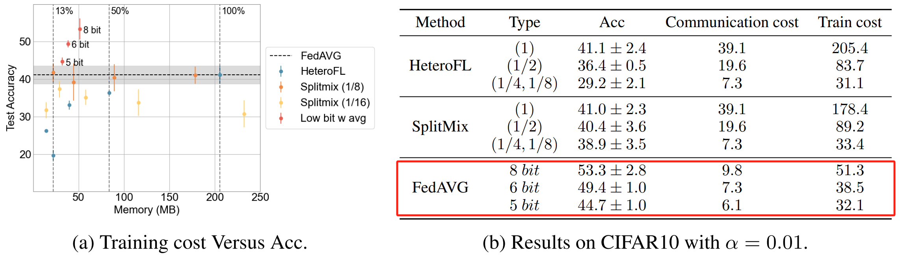
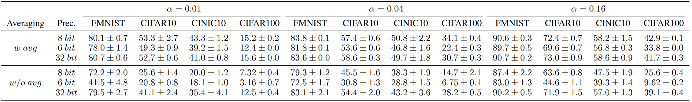
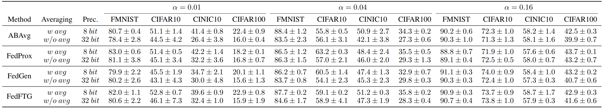

# [NeurIPS 2024] Low Precision Local Training is Enough for Federated Learning

This repository contains a PyTorch implementation of the paper:

[Low Precision Local Training is Enough for Federated Learning.](https://openreview.net/pdf?id=vvpewjtnvm)

Zhiwei, Li and Yiqiu, Li and Binbin, Lin and Zhongming, Jin and Weizhong, Zhang

## Strength
1. **Better performance and lower cost**



Our method outperforms other efficient Federated Learning (FL) methods on accuracy and traning & communication cost. We take [HeteroFL](https://github.com/diaoenmao/HeteroFL-Computation-and-Communication-Efficient-Federated-Learning-for-Heterogeneous-Clients) and [SplitMix](https://github.com/illidanlab/SplitMix) for example, as both of them contribute to decrease training & communication cost during FL.

2. **Compatibility with multiple FL methods**





Our method can maintain, and sometimes even surpass, the accuracy of standard FL approaches. Moreover, it is compatible with various FL methods, as shown in the table below.

|normal|regularization-based|data-dependent knowledge distill|data-free knowledge distill|
|:-:|:-:|:-:|:-:|
|[FedAVG](https://arxiv.org/pdf/1602.05629)|[FedProx](https://arxiv.org/pdf/1812.06127)|[ABAvg](https://ieeexplore.ieee.org/document/9521631)|[FedFTG](https://arxiv.org/pdf/2203.09249), [FedGen](https://arxiv.org/pdf/2105.10056)|


## Introduction
In this paper, we propose an efficient FL paradigm that significantly reduces the communication and computation costs during training. The key features of our approach are:

1. **Low-Precision Local Training**: The local models at clients are trained using low-precision operations (as low as 8 bits), which reduces both the computational load and memory usage without compromising performance.
   
2. **Low-Precision Communication**: The client and server send low-precision model weights to each other, reducing communication overhead.

3. **High-Precision Aggregation**: Only the model aggregation in the server is performed using high-precision computation, ensuring that the final model accuracy is preserved. Our method is compatible with existing FL algorithms, making it easy to integrate and deploy in real-world systems.

Our experimental results show that models trained with 8-bit precision perform comparably to those trained with full precision, demonstrating the effectiveness of our approach in maintaining high performance while significantly reducing resource consumption.

## Code

To get started with the implementation of our method, you can clone the repository and follow the instructions below.

```bash
# Clone the repository
git clone https://github.com/digbangbang/LPT-FL.git

# Install dependencies
pip install -r requirements.txt

# Run the demo script
python main.py --dataset fmnist --alpha 0.01 --model_name ConvNet --c_rounds 200 --project_name FL_experiment --block_dim BC --use_quantization --quantization_bits 8 --moving_average --ma_start 1 --moving_weight 0.9 --batch_size 32
```

The whole implementation of **FedAvg** are in ALL.sh, you can change the parameters to run other FL methods.

## Acknowledgements
This project uses modified code from the following projects:

- [SWALP](https://github.com/stevenygd/SWALP): developed by Cornell-CS. Block floating point quantization codes reused for low precision training. See models/quantizer.py.

## Cite

If you find our paper useful for your research and applications, please kindly cite using this BibTeX:

```latex
@inproceedings{
lilow,
title={Low Precision Local Training is Enough for Federated Learning},
author={Zhiwei, Li and Yiqiu, Li and Binbin, Lin and Zhongming, Jin and Weizhong, Zhang},
booktitle={The Thirty-eighth Annual Conference on Neural Information Processing Systems},
year={2024}
}
```
